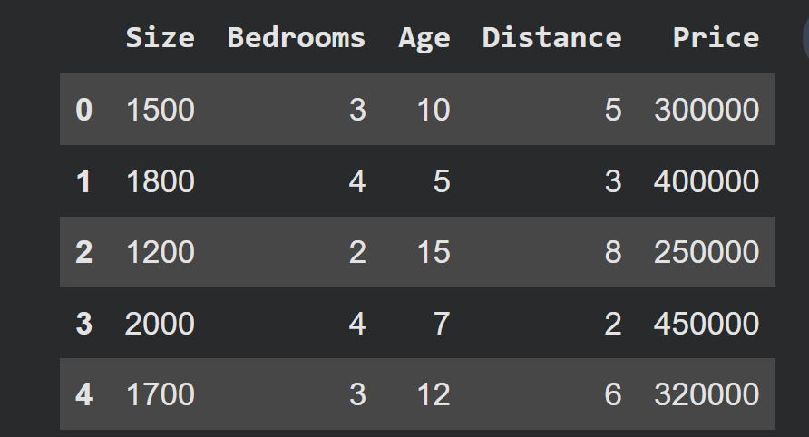
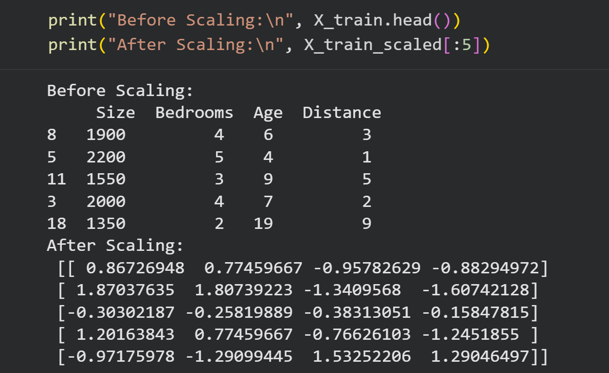
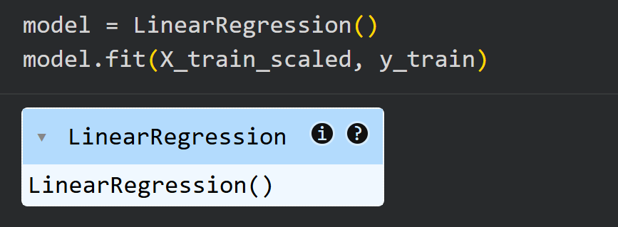
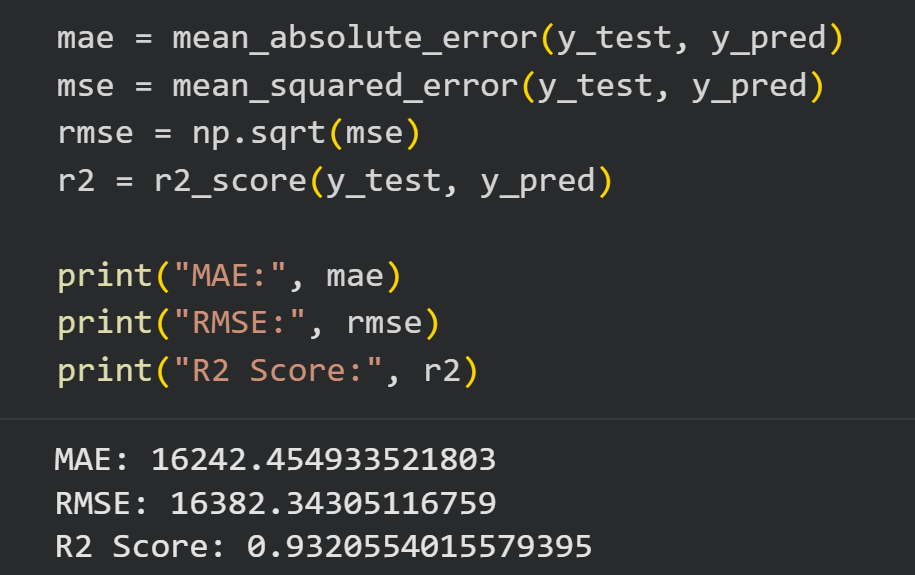
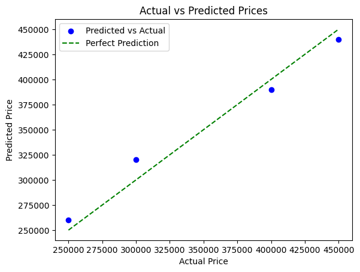

# 🏠 End-to-End Regression Project with StandardScaler

This project demonstrates an **end-to-end regression workflow** for predicting house prices using Python, Scikit-learn, and StandardScaler.  
It covers data preprocessing, model training, evaluation, and visualization — all implemented from scratch in Google Colab.

---

## 📌 Project Goals
- Predict house prices using regression
- Apply **StandardScaler** correctly to handle feature scaling
- Evaluate model performance with MAE, RMSE, and R²
- Visualize predictions vs actual values

---

## 📂 Repository Structure
- `dataset.csv` → Housing dataset (Size, Bedrooms, Age, Distance, Price)
- `end_to_end_regression.ipynb` → Complete Colab notebook implementation
- `screenshots/` → Key project outputs for documentation
  - `dataset_sample.PNG`
  - `feature_scaling.PNG`
  - `model_performance_metrics.PNG`
  - `actual_vs_predicted_prices_visualization.png`
- `README.md` → Project documentation

---

## 📊 Dataset Explanation

| Column   | Meaning                          |
|----------|----------------------------------|
| Size     | House size (square feet)         |
| Bedrooms | Number of bedrooms               |
| Age      | House age (years)                |
| Distance | Distance from city center        |
| Price    | House price (Target Variable)    |

---

## 🔑 Key Steps
1. **Data Loading & Exploration**  
   - Checked for missing values and feature scales  
   - Previewed dataset  

   

2. **Feature Scaling with StandardScaler**  
   - Converted features to standard normal distribution (mean = 0, std = 1)  
   - Prevented data leakage by fitting only on training data  

   

3. **Model Training**  
   - Applied Linear Regression on scaled features
   - Build Regression Model
  
     

4. **Model Evaluation**  
   - Metrics: MAE, RMSE, R²  
   - R² ≈ **0.93** → Strong regression performance  

   

5. **Visualization**  
   - Scatter plot of Actual vs Predicted Prices  
   - Green dashed line = Perfect Prediction line  

   

---

## 📈 Results
- **MAE:** ~16,242  
- **RMSE:** ~16,382  
- **R² Score:** ~0.93  

These results show that the regression model explains ~93% of the variance in house prices — a strong fit.

---

## 🚀 How to Run
1. Clone the repository:
   ```bash
   git clone https://github.com/Azizulhaq-professional/AI_DataScience.git
