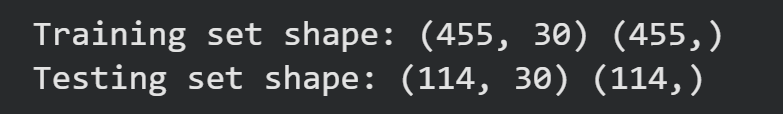
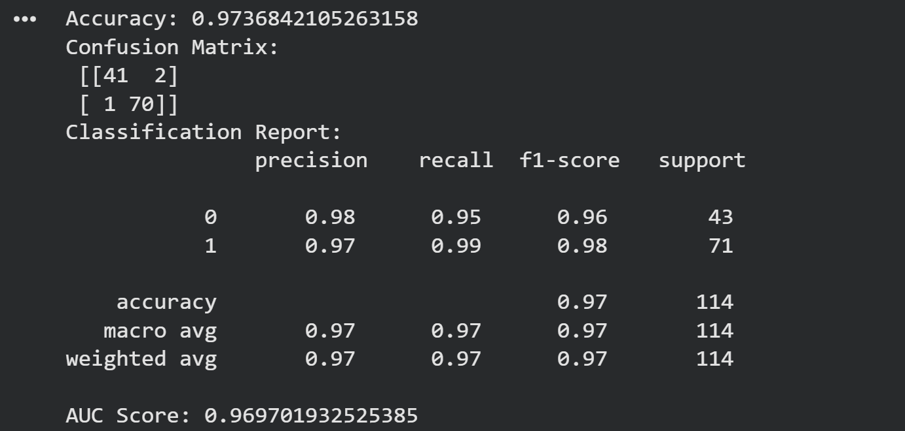
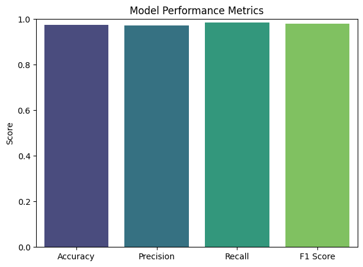
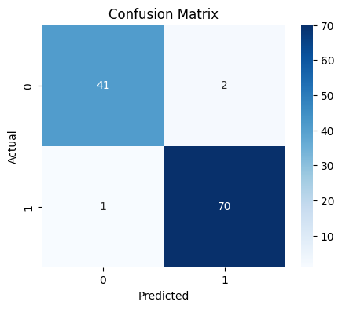
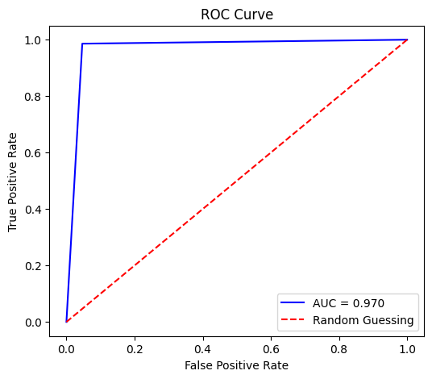

# Breast Cancer Classification using Logistic Regression

## 📌 Project Overview
This project applies **Logistic Regression** to classify tumors as **malignant (cancerous = 0)** or **benign (non-cancerous = 1)** using the **Breast Cancer Wisconsin dataset**.  
The goal is to build a reliable, interpretable model for medical decision support.

---

## 📊 Dataset
- **Source:** `sklearn.datasets.load_breast_cancer()`
- **Samples:** 569
- **Features:** 30 numerical medical features (radius, texture, perimeter, area, smoothness, etc.)
- **Target:** Binary (0 = malignant, 1 = benign)

---

## ⚙️ Workflow
1. **Dataset Loading**  
   Load features and target labels from scikit-learn.

2. **Train-Test Split**  
   - 80% training, 20% testing.  
   - Ensures evaluation on unseen data.  
   

3. **Standard Scaling**  
   - Features scaled to mean = 0, std = 1.  
   - Prevents large-scale features from dominating.  
   

4. **Model Training**  
   - Logistic Regression (`solver='liblinear'`).  
   - Fit on training data, predict on test data.  
   

---

## 📈 Evaluation Metrics
- **Accuracy:** ~97.36%  
- **Precision:** ~97%  
- **Recall:** ~98.6%  
- **F1 Score:** ~97.9%  
- **AUC Score:** ~0.97  

---

## 📸 Visualizations
### Model Performance Metrics

### Confusion Matrix

### ROC Curve

---

## 🎯 Key Insights
- Logistic Regression is a strong baseline for medical classification.  
- Recall is prioritized over accuracy in healthcare to minimize missed cancer cases.  
- ROC-AUC of 0.97 shows excellent discrimination ability.  
- Visualizations provide clear, recruiter-friendly evidence of performance.

---

## 🚀 Next Steps
- Add **cross-validation** for robustness.  
- Include **Precision-Recall curve** visualization.  
- Explore **feature importance** for medical interpretability.  

---

## 🔗 Repository
You can explore the full project here:  
[AI_DataScience Repository – Classification Project](https://github.com/Azizulhaq-professional/AI_DataScience/tree/main/classification_project)
