📊 End-to-End Data Preprocessing Pipeline for Machine Learning

🎯 Objective

To demonstrate a complete and structured pipeline for preparing raw data before applying machine learning models. This includes handling missing values, encoding, scaling, feature engineering, and splitting the dataset.

#### 🟢 Raw Dataset Preview
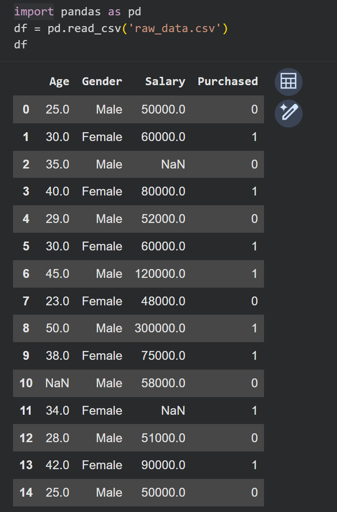

#### 🟡 Missing Values Summary
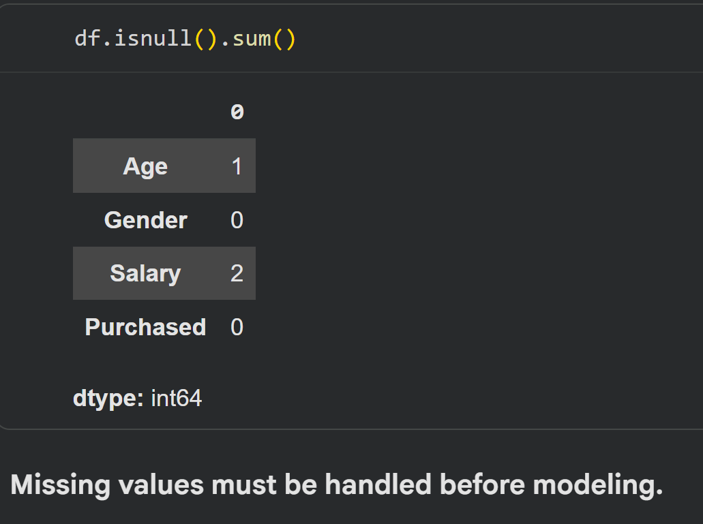

#### 🔴 Outlier Handling (IQR Method)
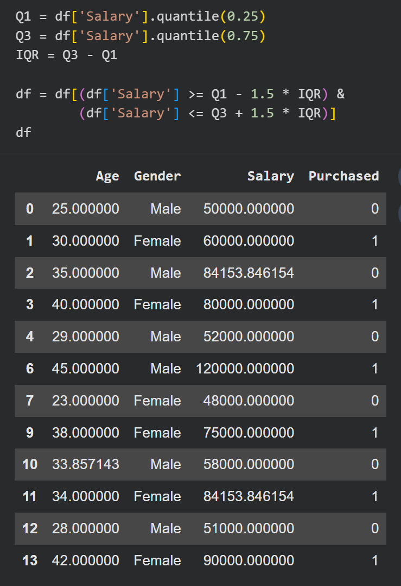

#### 🟣 Label Encoding (Gender)
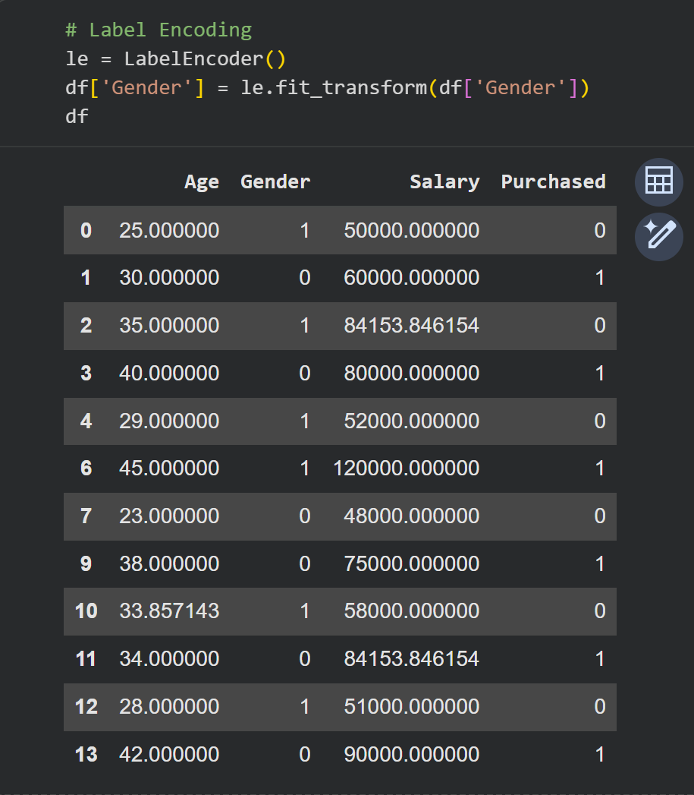

#### 🔵 Feature Scaling (Standardization)
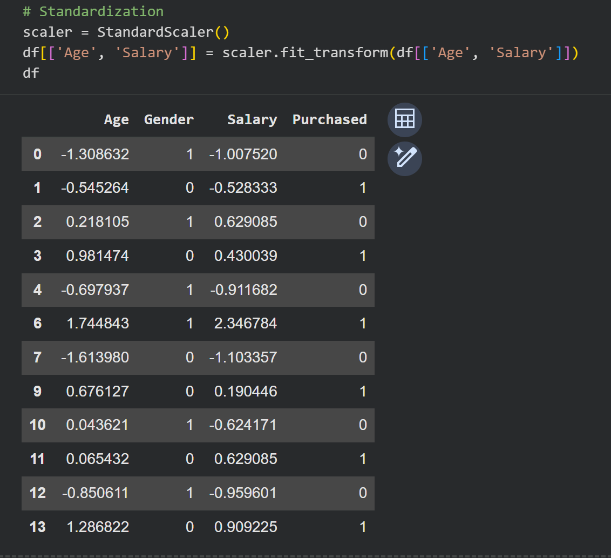

#### 🟠 Feature Engineering (`Salary_per_Age`)
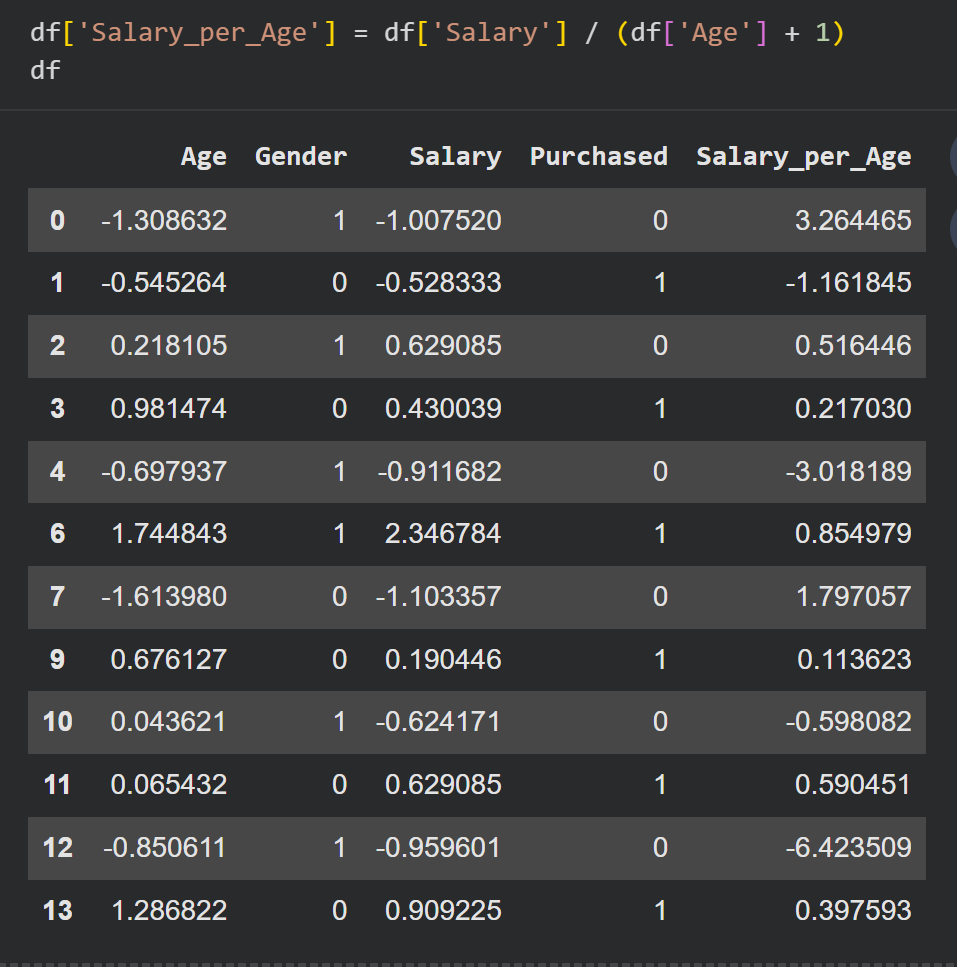

#### 🟤 Correlation Heatmap
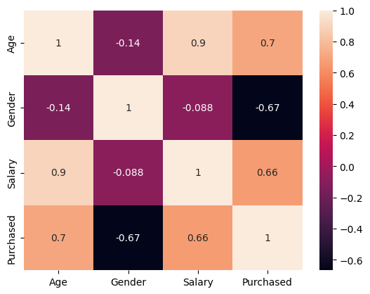

#### ⚪ Target Variable Distribution
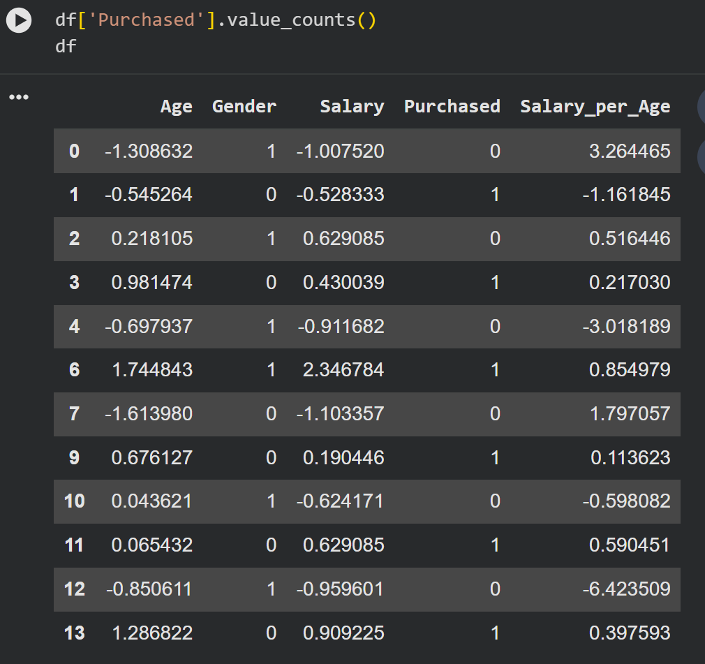

#### 🟩 Train/Test Split Shapes
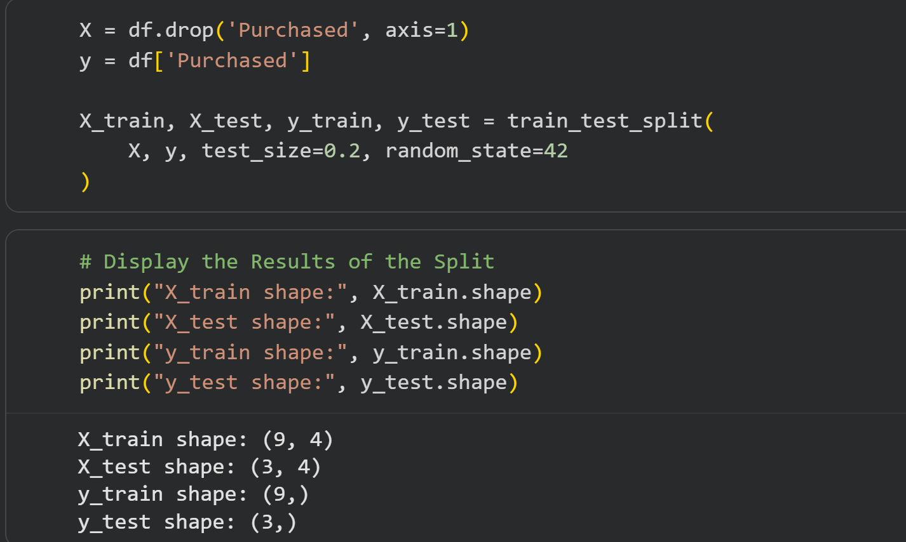

#### 🟨 Train Set Preview
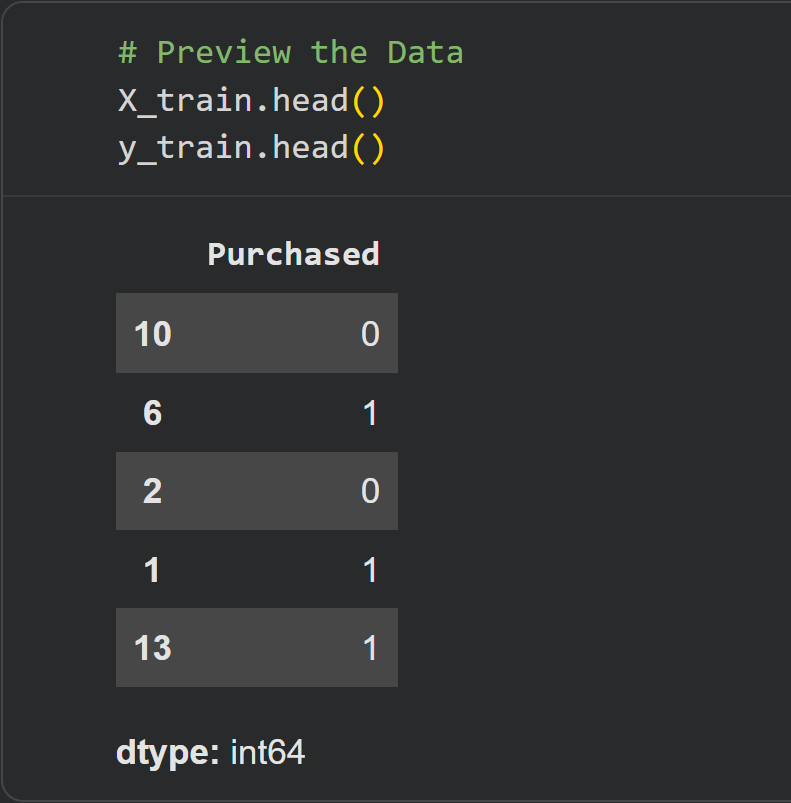

#### 🟧 Test Set Preview
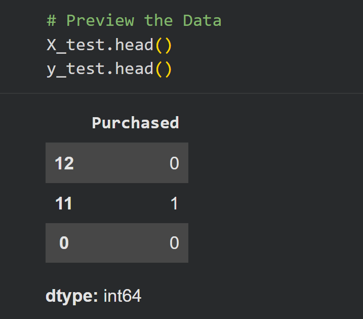

#### 🟫 Final Clean Dataset
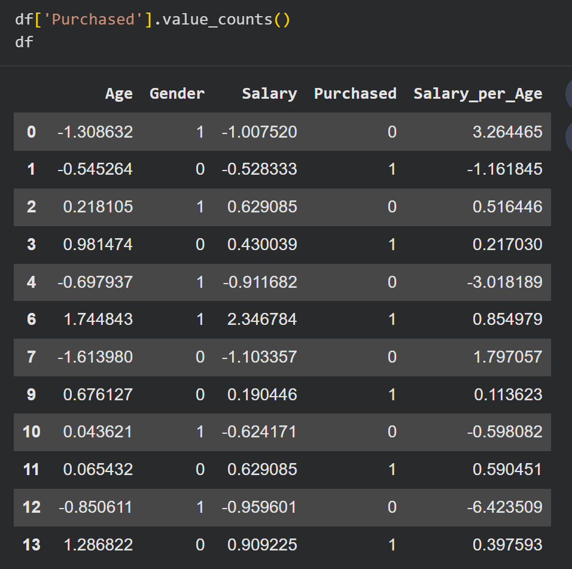
