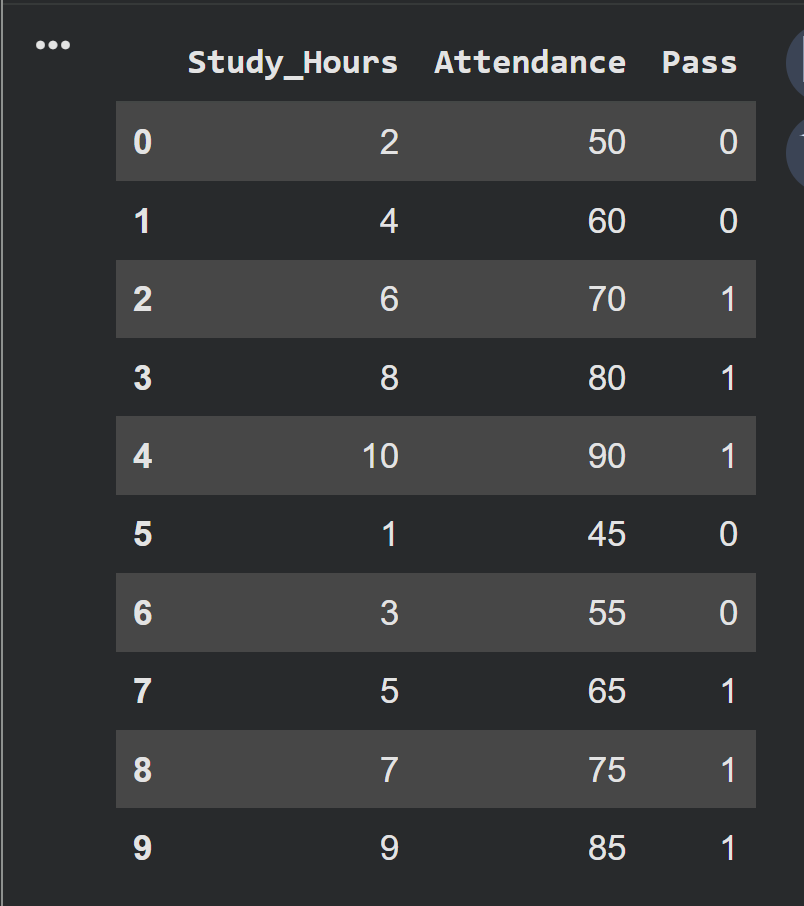
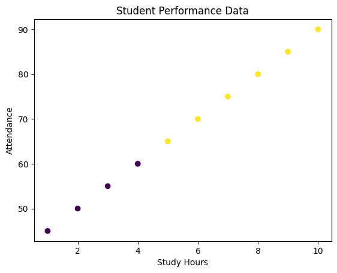
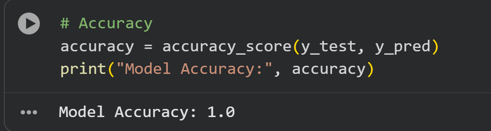

### Machine Learning Workflow
1. Data Collection
2. Data Understanding
3. Data Cleaning
4. Feature Selection
5. Train-Test Split
6. Model Training
7. Prediction
8. Model Evaluation
9. Visualization

🧪 Dataset Description
Features:
- Study_Hours: Number of hours studied per day
- Attendance: Attendance percentage

Target:
- Pass (1 = Pass, 0 = Fail)

🤖 Model Used
Logistic Regression
Why Logistic Regression?

Logistic Regression is suitable for binary classification problems and is easy to interpret for beginners.

📊 Results
Model Accuracy: 100% (on sample dataset)
Accuracy may vary with larger or real-world datasets.

📸 Screenshots
### 📋 Dataset Preview – Sample data with study hours, attendance, and pass/fail labels

### 📈 Model Visualization – Scatter plot showing performance patterns

### ✅ Model Accuracy Output – Confusion matrix and accuracy score

🚀 How to Run the Project
1. Clone the repository
2. Open the notebook in Google Colab or Jupyter
3. Run all cells step by step

📈 Future Improvements
- Use a real-world dataset
- Apply feature scaling
- Try different ML models
- Add cross-validation

🧑‍💻 Author

Aziz ul haq

Machine Learning & Cybersecurity Learner
